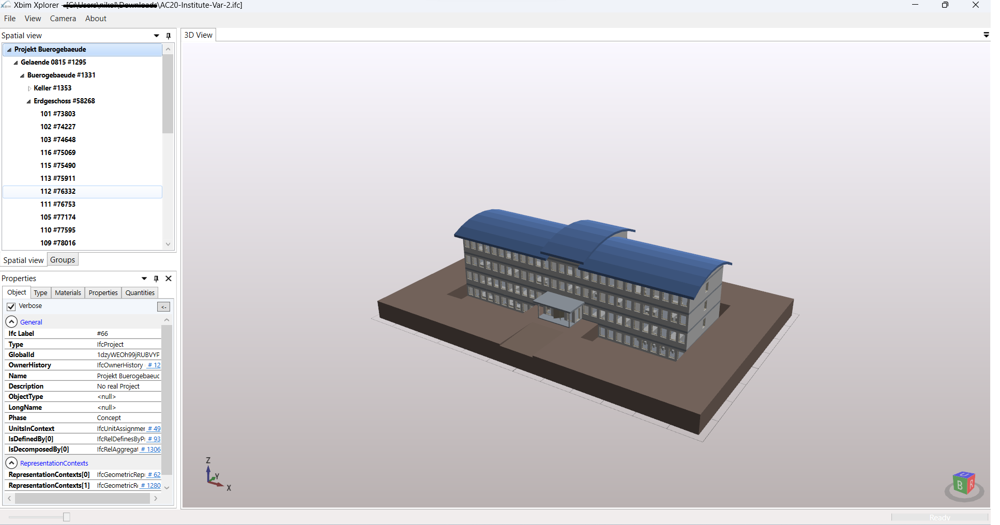

# BIM Basic manipulation
Basics for the manipulation of BIM files with the usage of python inside a Jupyter Notebook

# IfcOpenShell
A python package capable of read and write ifc files

# Xbim (C#)
A Nuget package identical to IfcOpenShell, capable of manipulate BIM objects with C#.

## Currently the visualisation for this repo is been held with the usage of ifc.exe which is published by Xbim Team

